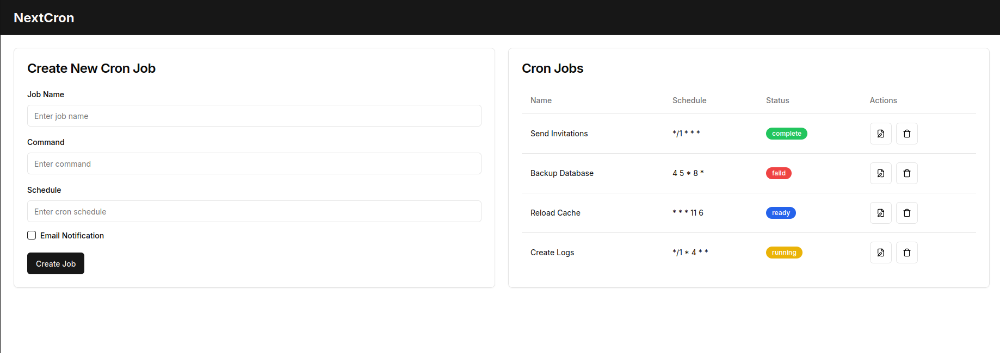

# NextCron

Ce projet est une application [Next.js](https://nextjs.org/) conçue pour gérer et planifier des cron jobs. Il utilise la puissance de Next.js pour les tâches côté serveur et la flexibilité des cron jobs pour automatiser diverses tâches.

